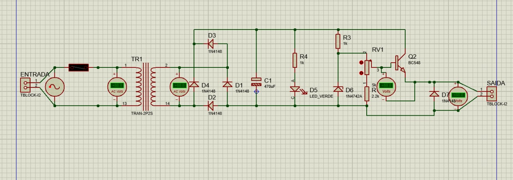
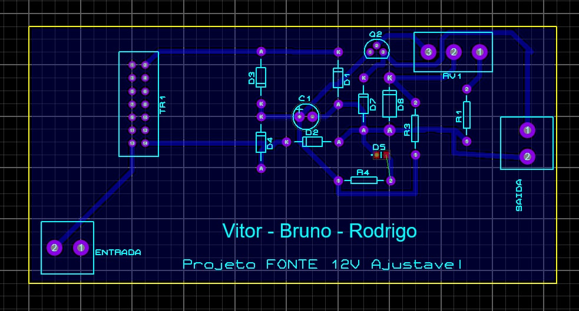

# Projeto 1 - Fonte de Tensão (SSC0118 - Eletrônica para Computação)
Projeto de uma Fonte de Tensão ajustável entre 3V a 12V com capacidade de 100mA
=======
Projeto de uma Fonte de Tensão ajustável entre 3V a 12V com capacidade de 100mA. A fonte possui uma Tensão RMS de 127V, com pico aproximado para 180V (arredondamos de um pico de 179.6V para um valor inteiro de 180V).

## Alunos:
Bruno Mitsuo Homma [github: brunohomma](https://github.com/brunohomma)

Rodrigo Valim Maciel [github: rvalimaciel](https://github.com/rvalimaciel)

Vitor Laperriere de Faria [github: vitorlape](https://github.com/vitorlape)

## Instruções:

## Escolha dos componentes:
| Quantidade | Componentes                 | Valor R$ |
|------------|-----------------------------|----------|
| 1          | Transformador 24v 200mA     | [R$27,99](https://tinyurl.com/transformador24v) |
| 4          | Diodo 1N4148                | [R$0,10 x 4 = R$0,40](https://tinyurl.com/vd29hv2v) |
| 3          | Resistores (1k, 1k, 2.2k)| [R$0,14 x 3 = R$0,42](https://tinyurl.com/resistor1k) |
| 1          | Capacitor Eletrolítico 470uF| [R$0,25](https://tinyurl.com/xkf6jmpc) |
| 1          | Potenciômetro 5k            | [R$2,70](https://tinyurl.com/25ct25jr) |
| 1          | Diodo Zenner                | [R$0,19](https://tinyurl.com/diodozener13v) |
| 1          | LED                         | [R$0,23](https://tinyurl.com/ledazul5mm) |
| 1          | Transistor bc337            | [R$0,20](https://tinyurl.com/transistorbc337) |
| 1          | Fusível 0.2A                | [R$0,60](https://tinyurl.com/65jvr5db) |
| **Total**  |                             |  R$32,98    |

## Os componentes

* **Transformador**: Esse componente tem a funcionalidade de converter os 180V de pico para 24V de pico por meio da relação e proporção de espiras em cada um dos dois lados.

* **Ponte de diodo**: Esse arranjo de diodos tem a funcionalidade de remover a parte negativa da senoide fornecida na entrada do circuito, assim o sentido da corrente fica apenas em uma direção.

* **Resistores**: Os resistores têm a função de limitar a corrente no circuito.

* **Capacitor**: O capacitor tem a função de suprir a corrente no circuito quando a mesma estiver descendente. Assim a corrente fica mais contínua e estável.

* **Potenciômetro**: O Potenciômetro é um resistor variável que controla a tensão na base do transistor.

* **Diodo Zener**: O diodo zener limita o valor máximo de tensão para a base do transistor. No caso, a tensão máxima escolhida é de 13V, pois o transistor tem um consumo de tensão de 0.7V, e para conseguirmos atingir o limite superior de 12V de tensão na saída da fonte, é necessário escolher um valor superior a 12 + 0,7.

* **LED**: O diodo emissor de luz (LED) informa que está tendo fluxo de corrente e assim o a fonte está ligada.

* **Transistor**: O transistor nesse circuito funciona como um regulador de tensão. Para que o transistor esteja ligado, é necessário que tenha uma diferença de potencial de 0,7V  entre a base e o emissor. Dessa maneira a tensão na base serve de referência para controlar a tensão máxima no emissor, que é a saída do circuito

* **Fusível**: O fusível é usado para proteger o circuito de picos de corrente, caso ultrapasse a corrente predeterminada, um filamento interno se rompe.

## Imagem do circuito

## Link do circuito no Falstad:
<a href="https://tinyurl.com/projetoeletronicafalstad" target="_blank">Clique aqui</a> para acessar o nosso circuito construido no Falstad.

## Fórmulas utilizadas

## Cálculo da relação de transformação
 (razão da transformação)

Como a potência na entrada do Transformador é o mesmo do que na saída, logo podemos afirmar que:

 Assim obtemos:

Queremos fazer a conversão de 127V para 12V, todavia iremos converter de 180V para 24V (considerando ambos como tensões de pico da entrada  e da saída do transformador )

### Cálculo da Tensão

### Cálculo da Capacitância

## Imagem esquemático da PCB

## Imagem PCB no programa Proteus

## Modelagem 3D da Fonte Ajustável 12V

## Vídeo de Explicação da Fonte
Vídeo disponível no [Drive do Bruno Homma]().

