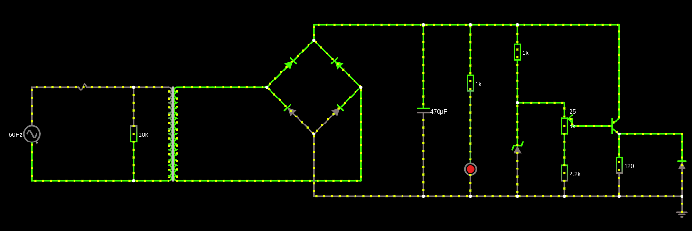
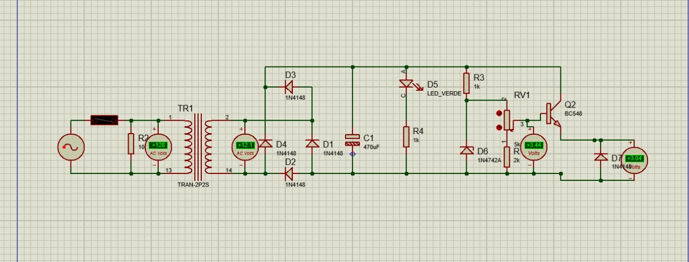
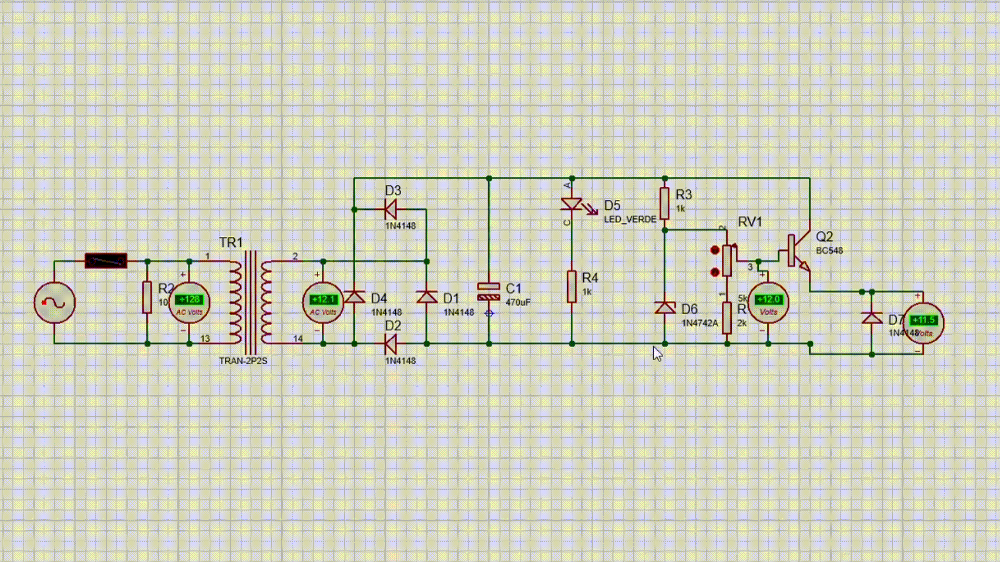
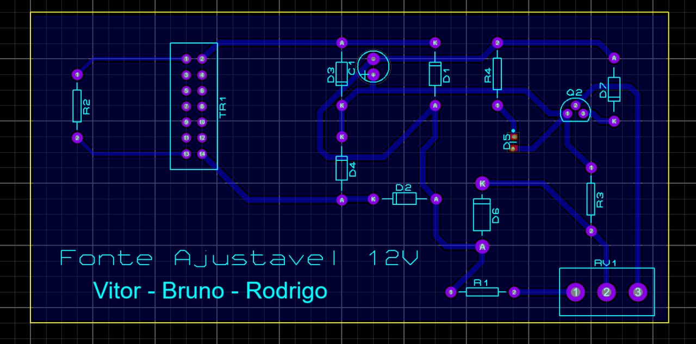
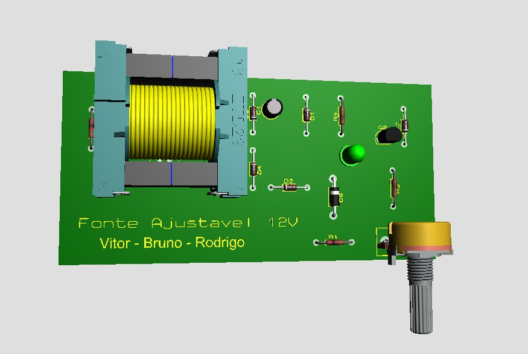

# Projeto 1 - Fonte de Tensão (SSC0118 - Eletrônica para Computação)
Projeto de uma Fonte de Tensão ajustável entre 3V a 12V com capacidade de 100mA. A fonte possui uma Tensão RMS de 127V, com pico aproximado para 180V (arredondamos de um pico de 179.6V para um valor inteiro de 180V).

## Alunos:
Bruno Mitsuo Homma [github: brunohomma](https://github.com/brunohomma)

Rodrigo Valim Maciel [github: rodrigo-maciel-ifood](https://github.com/rodrigo-maciel-ifood)

Vitor Laperriere de Faria [github: vitorlape](https://github.com/vitorlape)

## Instruções:

## Escolha dos componentes:
| Quantidade | Componentes                 | Valor R$ |
|------------|-----------------------------|----------|
| 1          | Transformador 12v 250mA     | [R$21,99](https://tinyurl.com/a4674dyj) |
| 5          | Diodo 1N4148                | [R$0,10 x 5 = R$0,50](https://tinyurl.com/vd29hv2v) |
| 4          | Resistores (10k, 1k, 1k, 2k)| [R$0,14 x 4 = R$0,56](https://tinyurl.com/4wckxvxy) |
| 1          | Capacitor Eletrolítico 470uF| [R$0,25](https://tinyurl.com/xkf6jmpc) |
| 1          | Potenciômetro 5k            | [R$2,70](https://tinyurl.com/25ct25jr) |
| 1          | Diodo Zenner                | [R$0,21](https://tinyurl.com/d9emevrh) |
| 1          | LED                         | [R$0,24](https://tinyurl.com/yya8psu8) |
| 1          | Transistor bc548            | [R$0,18](https://tinyurl.com/597hm6df) |
| 1          | Fusível 0.2A                | [R$0,60](https://tinyurl.com/65jvr5db) |
| **Total**  |                             |  R$27,23    |

## Os componentes

* **Transformador**: 
 
* **Ponte de diodo**: 

* **Resistores**: 

* **Capacitor**: 

* **Potenciometro**: 

* **Diodo Zener**: 

* **LED**:

* **Transistor**: 

* **Fusível**: 

## Imagem do circuito

## Link do circuito no Falstad:
<a href="https://tinyurl.com/yfo9azrl" target="_blank">Clique aqui</a> para acessar o nosso circuito construido no Falstad.

## Imagem esquemático da PCB

## Imagem PCB no programa Proteus

## Modelagem 3D da Fonte Ajustável 12V

## Vídeo no Youtube

## Agradecimentos
