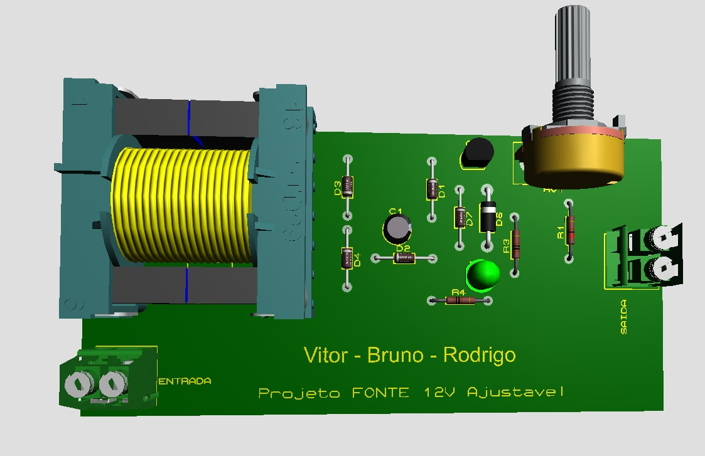

# Projeto 1 - Fonte de Tensão (SSC0118 - Eletrônica para Computação)
Projeto de uma Fonte de Tensão ajustável entre 3V a 12V com capacidade de 100mA. A fonte possui uma Tensão RMS de 127V, com pico aproximado para 180V (arredondamos de um pico de 179.6V para um valor inteiro de 180V).

## Alunos:
Bruno Mitsuo Homma [github: brunohomma](https://github.com/brunohomma)

Rodrigo Valim Maciel [github: rodrigo-maciel-ifood](https://github.com/rodrigo-maciel-ifood)

Vitor Laperriere de Faria [github: vitorlape](https://github.com/vitorlape)

## Instruções:

## Escolha dos componentes:
| Quantidade | Componentes                 | Valor R$ |
|------------|-----------------------------|----------|
| 1          | Transformador 12v 250mA     | [R$21,99](https://tinyurl.com/a4674dyj) |
| 5          | Diodo 1N4148                | [R$0,10 x 5 = R$0,50](https://tinyurl.com/vd29hv2v) |
| 4          | Resistores (10k, 1k, 1k, 2k)| [R$0,14 x 4 = R$0,56](https://tinyurl.com/4wckxvxy) |
| 1          | Capacitor Eletrolítico 470uF| [R$0,25](https://tinyurl.com/xkf6jmpc) |
| 1          | Potenciômetro 5k            | [R$2,70](https://tinyurl.com/25ct25jr) |
| 1          | Diodo Zenner                | [R$0,21](https://tinyurl.com/d9emevrh) |
| 1          | LED                         | [R$0,24](https://tinyurl.com/yya8psu8) |
| 1          | Transistor bc548            | [R$0,18](https://tinyurl.com/597hm6df) |
| 1          | Fusível 0.2A                | [R$0,60](https://tinyurl.com/65jvr5db) |
| **Total**  |                             |  R$27,23    |

## Os componentes

* **Transformador**: Esse componente tem a funcionalidade de converter os 127V para 12V por meio da relção e proporção de espiras em cada um dos dois lados.
 
* **Ponte de diodo**: Esse arranjo de diodos tem a funcionalidade de remover a parte negativa da senoide fornecida na entrada do circuito, assim o sentido da corrente fica apenas em uma direção.

* **Resistores**: Os resistores tem a função de limitar a corrente no circuito.

* **Capacitor**: O capacitor tem a função de suprir a corrente no circuito quando a mesma estiver descendente. Assim a corrente fica mais contínua e estável.

* **Potenciômetro**: O Potenciômetro é um resistor variável que controla o fluxo de corrente fornecida para o transistor, desse modo controla proporcionalmente a tensão da saída.

* **Diodo Zener**: O diodo zener limita o valor máximo de tensão para a saída do circuito. No caso, a tensão máxima escolhida é de 13V, pois o diodo tem um consumo de tensão de 0.7V, e para conseguirmos atingir o limite superior de 12V de tensão na saída da fonte, é necessário essas escolha do valor.

* **LED**: O diodo emissor de luz (LED) informa que está tendo fluxo de corrente e assim o a fonte está ligada.

* **Transistor**: O transistor nesse circuito funciona como uma chave controladora de corrente. O controle é feito pelo potenciômetro ligado a base.

* **Fusível**: O fusível é usado para proteger o circuito de picos de corrente, caso ultrapasse a corrente predeterminada, um filamento interno se rompe.

## Imagem do circuito

## Link do circuito no Falstad:
<a href="https://tinyurl.com/ygwvpcdr" target="_blank">Clique aqui</a> para acessar o nosso circuito construido no Falstad.

## Imagem esquemático da PCB

## Imagem PCB no programa Proteus

## Modelagem 3D da Fonte Ajustável 12V

## Vídeo de Explicação da Fonte
Vídeo disponível no [Drive do Bruno Homma](https://drive.google.com/file/d/1kfTTBMaAYUW9w2UQ1F7QJMbiZ3snIgpZ/view?usp=sharing).

## Agradecimentos
Queremos agradecer ao Ilustre professor Eduardo Simões, por nos proporcionar a elaboração de uma atividade que tem uma suma importância para entendermos o funcionamento de circuitos digitais utilizando conhecimentos de eletrônica.
Gostaríamos de Parabenizar o membro do nosso grupo [Vitor Laperriere de Faria](https://github.com/vitorlape) por oferecer e compartilhar seus conhecimentos adquiridos em um curso técnico em eletrônica. Sem sua colaboração, atuando como membro desse grupo, teríamos mais dificuldades com o desenvolvimento do Trabalho.